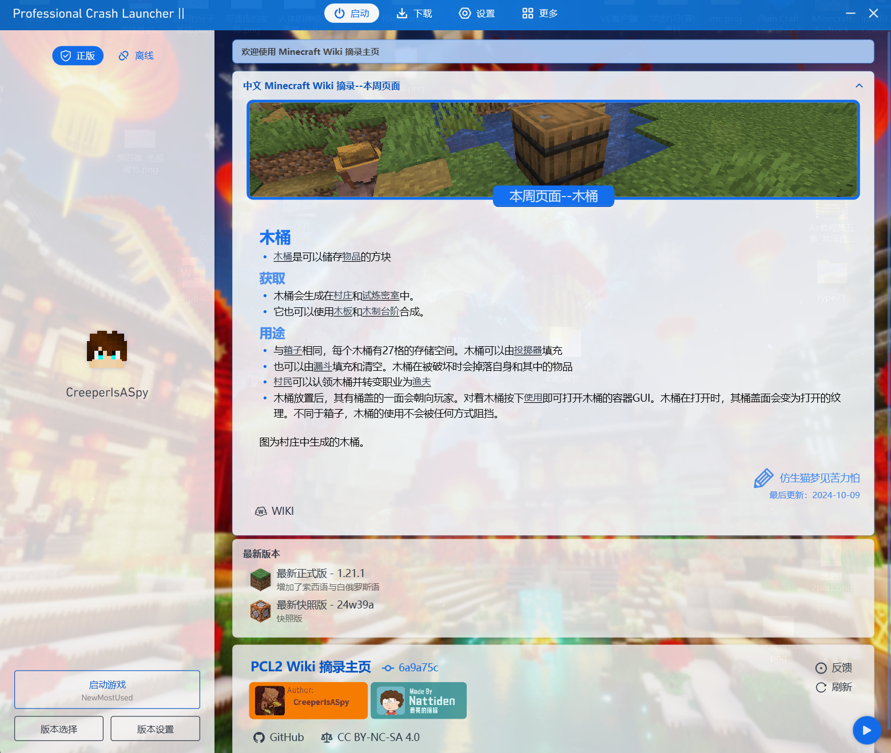

# Megazine Homepage for PCL2

***A PCL2 Homepage -- Smart,modern and elegant.***

## What is included in this homepage:

- Minecraft real-time updated news (@Light-Beacon);
- [Minecraft Wiki](https://zh.minecraft.wiki) Excerpts;
- Translated, Official Minecraft Blogs from [Minecraft.net](https://minecraft.net).

## Usage:

1. Use presets  
   First, open your Plain Craft Launcher(Please use the latest version).
   Secondly, turn to `Settings` page.
   Then, turn to the `Personalization`tab on the left side.
   Next, scroll down and find the `Homepages` card and choose the `presets` selection.
   After that, select `Megazine Homepage` in the combobox below.
   Finally, reboot the launcher, you'll see the *brand new* Homepage!
2. Use Online Update Mode
   First, follow the instructions 1 to 3 in `Use presets` section.
   Then, choose the `Online` selection.
   Next, enter `https://pclhomeplazaoss.lingyunawa.top:27000/d/Homepages/Ext1nguisher/Custom.xaml` in the entry.
   Finally, reboot the launcher.

## Acknowledgement:

- LingyunAwA (JingHai-Lingyun @Github)(1913532130 @QQ)
- Mr.Joker (Joker2184 @Github)(754284083 @QQ)
- Essdak1986 (1837750594 @QQ)
- tu_xing (2480379448 @QQ)
- Nattiden (Light-Beacon @Github)(2682645990 @QQ)

## License

[CC-BY-NC-SA 4.0](https://creativecommons.org/licenses/by-nc-sa/4.0/) for most of the Homepage.  

[CC-BY-NC-SA 3.0](https://creativecommons.org/licenses/by-nc-sa/3.0/) for Minecraft Wiki Excerpt Contents.  

[MIT License](https://mit-license.org/) for News card.  

***Thank you for choosing us!***
